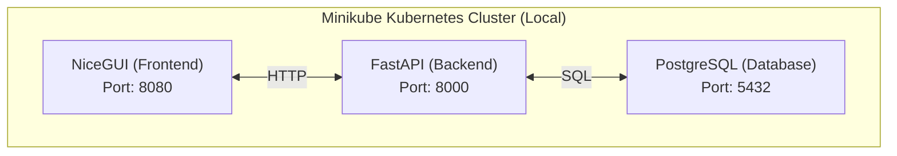

# 📱 Phonebook App

A full-stack contact management application built with FastAPI (backend), NiceGUI (frontend), PostgreSQL (database), and Kubernetes (orchestration via Minikube). Features complete CRUD operations with a modern web interface.

# 🏗️ Architecture



# 📁 Project Structure

```
phonebook-app/
├── 📁 backend/                 # FastAPI REST API
│   ├── 📁 app/
│   │   ├── 🐍 __init__.py
│   │   └── 🐍 main.py          # API endpoints & SQLAlchemy models
│   ├── 🐍 config.py            # Pydantic settings (DB credentials)
│   ├── 🐍 __init__.py
│   ├── 🐳 Dockerfile           # Backend container image
│   └── 📄 requirements.txt     # Python dependencies
│
├── 📁 frontend/                # NiceGUI web interface
│   ├── 📁 app/
│   │   ├── 🐍 __init__.py
│   │   └── 🐍 main.py          # UI components & HTTP client
│   ├── 🐳 Dockerfile           # Frontend container image
│   └── 📄 requirements.txt     # Python dependencies
│
├── 📁 k8s-manifests/           # Kubernetes Infrastructure as Code
│   ├── ⚙️ backend.yaml         # Backend Deployment + Service
│   ├── ⚙️ frontend.yaml        # Frontend Deployment + Service
│   ├── ⚙️ postgres.yaml        # PostgreSQL Deployment + Service
│   └── ⚙️ secret.yaml.template # Secrets template (not committed. create a local one and add your creds!)
│
├── 📁 .github/workflows/       # CI/CD Pipeline
│   └── ⚙️ pb-app-ci-cd.yaml    # GitHub Actions workflow
│
├── ⚙️ .gitignore               # Excludes .env, secret.yaml, etc.
├── 📄 .env                     # Local development environment variables
└── 📝 README.md                # This file
```

# 🚀 Quick Start (Local Development)

**Prerequisites**

| Tool           | Version | Purpose              |
| -------------- | ------- | -------------------- |
| Python         | 3.11.3  | Runtime              |
| Docker Desktop | Latest  | Containerization     |
| Minikube       | Latest  | Local Kubernetes     |
| kubectl        | Latest  | K8s CLI              |
| PostgreSQL     | 17+     | Database (local dev) |


## 🗄️ Step 1: Create Local Database

### Option A: Using Docker (Recommended)

```bash
# Run PostgreSQL in a Docker container
docker run -d \
  --name phonebook-postgres \
  -e POSTGRES_USER=postgres \
  -e POSTGRES_PASSWORD=password \
  -e POSTGRES_DB=phonebookdb \
  -p 5432:5432 \
  postgres:15-alpine
```

### Option B: Using Local PostgreSQL Installation

```bash
# Create database manually
psql -U postgres -c "CREATE DATABASE phonebookdb;"
```

### Verify Database Connection

```bash
# Test connection
psql -h localhost -U postgres -d phonebookdb -c "\dt"
```


## ⚙️ Step 2: Environment Configuration

Create a `.env` file in the project root:

```bash
# .env — Local Development Only (NEVER commit this file!)

# Database Configuration
DB_USER=postgres
DB_PASSWORD=password
DB_NAME=phonebookdb
DB_HOST=localhost
DB_PORT=5432

# Backend API URL (for local frontend testing)
BACKEND_API_URL=http://localhost:8000
```

🔒 Security Note: ``.env`` is listed in .gitignore to prevent accidental commits of credentials.

## 🖥️ Step 3: Run Backend Locally

```bash
# Navigate to backend directory
cd backend

# Create virtual environment (recommended)
python -m venv .venv
source .venv/bin/activate  # Linux/Mac
# or: .venv\Scripts\activate  # Windows

# Install dependencies
pip install -r requirements.txt

# Start the API server
uvicorn app.main:app --host 0.0.0.0 --port 8000 --reload
```

### Verify Backend
- API Docs (Swagger UI): http://localhost:8000/docs
- Health Check: http://localhost:8000/docs (FastAPI auto-generated)
- Test endpoint:

```bash
curl -X POST "http://localhost:8000/contacts/" \
  -H "Content-Type: application/json" \
  -d '{"first_name":"Mini","last_name":"Minor","phone":"+2374567890","email":"name@example.cm"}'
```

## 🎨 Step 4: Run Frontend Locally

```bash
# In a new terminal, navigate to frontend directory
cd frontend

# Activate same virtual environment (or create new)
pip install -r requirements.txt

# Start the UI server
python app/main.py
```

### Access Frontend
- Web UI: http://localhost:8080
- The frontend will connect to BACKEND_API_URL from your ``.env`` file


### 🐳 Docker Local Testing

#### Build Images

```bash
# From project root

# Build backend image
docker build -t phonebook-backend:test -f backend/Dockerfile .

# Build frontend image
docker build -t phonebook-frontend:test -f frontend/Dockerfile .
```

#### Run Containers

```bash
# Run backend (connects to local Postgres)
docker run -p 8000:8000 --env-file .env phonebook-backend:test

# Run frontend (in new terminal)
docker run -p 8080:8080 --env-file .env phonebook-frontend:test
```


## ☸️ Step 5: Deploy to Minikube (Local K8s)

### Start Minikube

```bash
# Start Minikube cluster
minikube start --driver=docker

# Verify cluster is running
kubectl get nodes
```

### Create Secrets

```bash
# Copy the template
cp k8s-manifests/secret.yaml.template k8s-manifests/secret.yaml

# Edit with your credentials (or use this for local dev)
cat > k8s-manifests/secret.yaml << 'EOF'
apiVersion: v1
kind: Secret
metadata:
  name: phonebook-secrets
type: Opaque
stringData:
  DB_USER: "user"
  DB_PASSWORD: "password"
  DB_HOST: "postgres"
  DB_NAME: "phonebookdb"
EOF
```


⚠️ Never commit secret.yaml to Git! It's already in .gitignore.


### Build & Load Images into Minikube

```bash
# Build images inside Minikube's Docker daemon (PowerShell)
# For Linux/Mac, use: eval $(minikube docker-env)
& minikube -p minikube docker-env --shell powershell | Invoke-Expression

# Build images
docker build -t phonebook-backend:latest -f backend/Dockerfile .
docker build -t phonebook-frontend:latest -f frontend/Dockerfile .
```

**Alternative (cross-platform):**

```bash
# Build directly with Minikube
minikube image build -t phonebook-backend:latest -f backend/Dockerfile .
minikube image build -t phonebook-frontend:latest -f frontend/Dockerfile .
```

### Deploy to Kubernetes

```bash
# Apply all manifests
kubectl apply -f k8s-manifests/

# Verify deployments
kubectl get pods
kubectl get services
```

### Access the Application

```bash
# Get frontend URL (opens browser or returns URL)
minikube service frontend --url
# Example output: http://127.0.0.1:61890

# Access backend API docs through port-forward
kubectl port-forward svc/backend 8000:8000
# Then visit: http://localhost:8000/docs
```


### Verify Everything Works

```bash
# Check all pods are running
kubectl get pods -w

# View backend logs
kubectl logs -f deployment/backend

# View frontend logs
kubectl logs -f deployment/frontend

# Test API from inside cluster
kubectl exec -it deployment/backend -- curl http://backend:8000/contacts/
```


# 🛠️ Troubleshooting

**Issue**: relation "``contacts``" does not exist

**Cause**: Database tables not created.

**Fix**: The backend auto-creates tables on startup via ``Base.metadata.create_all()``. If missing, restart the backend pod:

```bash
kubectl rollout restart deployment/backend
```

**Issue**: ModuleNotFoundError: No module named 'backend'

**Cause**: Wrong Docker build context.

**Fix**: Build from project root, not backend/ directory:

```bash
docker build -t phonebook-backend:test -f backend/Dockerfile .
```

**Issue**: Frontend shows "Error loading contacts"

**Cause**: ``API_URL`` environment variable not set.

**Fix**: Check frontend env var:

```bash
kubectl exec -it deployment/frontend -- env | grep API
```

# 📚 API Endpoints

| Method   | Endpoint         | Description        |
| -------- | ---------------- | ------------------ |
| `POST`   | `/contacts/`     | Create new contact |
| `GET`    | `/contacts/`     | List all contacts  |
| `GET`    | `/contacts/{id}` | Get single contact |
| `PUT`    | `/contacts/{id}` | Update contact     |
| `DELETE` | `/contacts/{id}` | Delete contact     |


### Example Request

```bash
curl -X POST "http://localhost:8000/contacts/" \
  -H "Content-Type: application/json" \
  -d '{
    "first_name": "Jane",
    "last_name": "Smith",
    "phone": "+1-555-0123",
    "email": "jane.smith@example.com"
  }'
```

# 🧹 Cleanup

```bash
# Delete K8s resources
kubectl delete -f k8s-manifests/

# Stop Minikube
minikube stop

# Delete Minikube cluster (optional)
minikube delete

# Stop local Docker containers
docker stop phonebook-postgres
docker rm phonebook-postgres
```

# 🤝 Contributing

1. Fork the repository
2. Create a feature branch (``git checkout -b feature/amazing-feature``)
3. Commit changes (``git commit -m 'Add amazing feature'``)
4. Push to branch (``git push origin feature/amazing-feature``)
5. Open a Pull Request